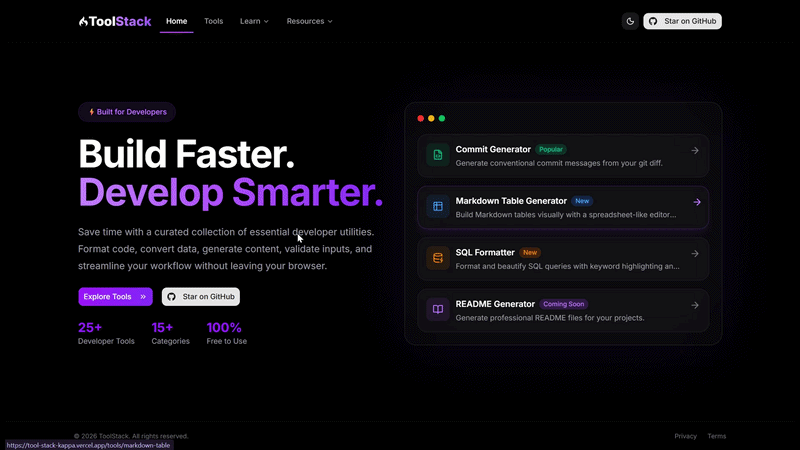

<div align="center">

# 🛠️ Tool Stack

**A modern collection of developer utilities built for speed, simplicity, and productivity.**

[](https://nextjs.org/)
[](https://www.typescriptlang.org/)
[](https://tailwindcss.com/)
[](https://tool-stack-kappa.vercel.app/)
[](LICENSE)


[🌐 Live Demo](https://tool-stack-kappa.vercel.app/) · [🐛 Report a Bug](https://github.com/lazytech614/tool-stack/issues) · [✨ Request a Feature](https://github.com/lazytech614/tool-stack/issues)

</div>

---

## 📖 Table of Contents

- [About the Project](#-about-the-project)
- [Demo](#-demo)
- [Features](#-features)
- [Tech Stack](#-tech-stack)
- [Architecture](#-architecture)
- [Project Structure](#-project-structure)
- [Getting Started](#-getting-started)
  - [Prerequisites](#prerequisites)
  - [Installation](#installation)
  - [Environment Variables](#environment-variables)
  - [Running Locally](#running-locally)
- [Future Vision](#-future-vision)
- [Contributing](#-contributing)
- [License](#-license)

---

## 🚀 About the Project

**Tool Stack** is an all-in-one developer utility platform that brings together commonly needed tools under one roof. Whether you're debugging a JWT, testing a regex pattern, encoding a payload, or generating a meaningful Git commit message — Tool Stack has you covered.

Built with the latest versions of Next.js, TypeScript, and Tailwind CSS v4, the app prioritizes performance and a clean developer experience. It integrates Google Gemini AI to power intelligent features like commit message generation, and Upstash Redis for rate limiting to ensure fair usage.

---

## 🎥 Demo

<p align="center">
  
</p>

---

## ✨ Features

- 🔐 JWT Debugger
- 📝 Git Commit Generator (AI)
- 🔤 Regex Tester
- 🔁 Number Base Converter
- 📚 Developer Learning Resources
- 📦 Curated Developer Resources

---

## 🧱 Tech Stack

| Category | Technology |
|---|---|
| **Framework** | [Next.js 16](https://nextjs.org/) (App Router), [TypeScript](https://www.typescriptlang.org/) |
| **Styling & UI** | [Tailwind CSS v4](https://tailwindcss.com/), [shadcn/ui](https://ui.shadcn.com/), [Radix UI](https://www.radix-ui.com/) |
| **Developer Experience** | [Shiki](https://shiki.matsu.io/), [react-markdown](https://github.com/remarkjs/react-markdown), remark-gfm, [Sonner](https://sonner.emilkowal.ski/) |
| **Utilities** | [Lucide React](https://lucide.dev/), [React Icons](https://react-icons.github.io/react-icons/), [Zod](https://zod.dev/), [Framer Motion](https://www.framer.com/motion/) |
| **Backend & AI** | [Google Gemini API](https://ai.google.dev/), [Upstash Redis](https://upstash.com/) |
| **Deployment** | [Vercel](https://vercel.com/) |

---

## 🏗 Architecture

ToolStack follows a modular architecture where each feature lives in its own directory, making it easy to develop and contribute independently.

---

## 📁 Project Structure

```text
tool-stack/
├── app/
│   ├── api/
│   ├── tools/
│   ├── learn/
│   └── resources/
├── components/
├── constants/
├── hooks/
├── lib/
├── providers/
├── public/
├── types/
└── package.json
```

---

## 🏁 Getting Started

### Prerequisites

Make sure you have the following installed:

- Node.js >=18
- npm, yarn, or pnpm

> Environment variables are only required if you're using the Git Commit Generator.

### Installation

1. **Clone the repository:**

```bash
git clone https://github.com/lazytech614/tool-stack.git
cd tool-stack
```

2. **Install dependencies:**

```bash
npm install
# or
yarn install
# or
pnpm install
```

### Environment Variables

Copy the example env file and fill in your credentials:
> [!NOTE]
> Environment variables are only required for the **Git Commit Generator** tool.

```bash
cp .env.example .env.local
```

Then open `.env.local` and set the following:

```env
# Google Gemini API key for AI-powered commit generation
GEMINI_API_KEY=""

# Upstash Redis for rate limiting
UPSTASH_REDIS_REST_URL=""
UPSTASH_REDIS_REST_TOKEN=""
```

| Variable | Where to get it |
|---|---|
| `GEMINI_API_KEY` | [Google AI Studio](https://aistudio.google.com/app/apikey) |
| `UPSTASH_REDIS_REST_URL` | [Upstash Console](https://console.upstash.com/) → your Redis database |
| `UPSTASH_REDIS_REST_TOKEN` | [Upstash Console](https://console.upstash.com/) → your Redis database |

### Running Locally

```bash
npm run dev
```

Open [http://localhost:3000](http://localhost:3000) in your browser.

**Other available scripts:**

```bash
npm run build    # Build for production
npm run start    # Start the production server
npm run lint     # Run ESLint
```

## 🎯 Future Vision

ToolStack aims to become the largest open-source hub for developer tools, learning resources, templates, starter kits, extensions, and other productivity resources—all in one place.

---

## 🤝 Contributing

Contributions of all kinds are welcome! Whether you're fixing bugs, improving the UI, adding developer tools, expanding documentation, or contributing learning resources, we'd love your help.

If you're new to open source, look for issues labeled `good first issue` or `help wanted` to get started.

> 📖 **Before contributing, please read [CONTRIBUTING.md](./CONTRIBUTING.md) for the complete contribution guide, setup instructions, workflow, and coding standards.**
>
> Please also review our [Code of Conduct](./CODE_OF_CONDUCT.md).

---

## 📄 License

Distributed under the MIT License. See [`LICENSE`](./LICENSE) for more information.

---

<div align="center">

Made with ❤️ by <a href="https://github.com/lazytech614"><strong>lazytech614</strong></a>
⭐ If you find Tool Stack useful, consider starring the repository!
  <a href="https://tool-stack-kappa.vercel.app/">🌐 tool-stack-kappa.vercel.app</a>

</div>
